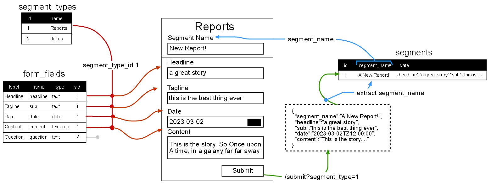

# Dynamic Form Rendering Example

This is an example of dynamic form rending, using MVC model and base PHP. 

## Setup

Make sure you have PHP installed and instance of MySQL running (MAMP reccomended) 

Clone the project to a local repository. Set MAMP project root to this folder.

Start the server. Open PHP my admin, and import the `templategen.sql` file into a database of the same name.

Back in the code, open `connect.php` and point to DB connection to your database instance.

navigate to the following address:

`localhost/segments/new?segment_type_id=1`

- 1 - Reports
- 2 - Games
- 3 - Jokes

## What it is 

A Form that changes the form fields dynamically based on the segment_type selected. The data is stored in the same database regardless of the form fields specified, as a JSON object. 

a list route has been included to see how the data can be parsed and rendered dynamically.

## How it works

The main table here is the segment_types. Each table revolves around that. WHen you load 

form fields are stored in a form_field table. they are linked to a segment_type. 

routing to the edit form requires the specification of the segment_type_id.

When the form is loaded, all required tables from the segments table (where the data will end up), is loaded.

the Controller pulls all fields related to that segment_type_id, and renders them based on the field type.

When the user submits the form, the segment_name is extracted so it can go into its own column. The rest of the data is packaged into a JSON object, and stored in the data column.

Retrieve is just a matter of reversing the data JSON packaging, and printing out the fields as desired. As the data is in JSON, the field names are preserved.

## Routes
- `/segments/list` : list all semgents
- `/segments/new?segment_type_id=?` : load the form for the segment_type_id
- `/segments/submit?segment_type_id=?`: POST. Submission route for the segment.